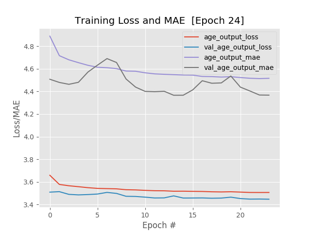

# About

This is an improved version of the model detailed in my previous [repository](https://github.com/duongntbk/age_estimator_model/). Instead of predicting gender and guessing age independently, it would make more sense to use gender information while guessing age. After all, the features we can use to guess the age of males is very different from that of females.

In this repository, we use a new architecture named AgeGenderNet, which is a modified version of VGG19 network, to reach 97.01% accuracy for gender predicting and 3.67 MAE (mean absolute error) for age guessing on test data of AFAD dataset. 

The resulting model can be used with the AgeEstimatorSharp library, details in the following repository:

https://github.com/duongntbk/AgeEstimatorSharp

**Note**: due to the size of the dataset and the complexity of the network, it is highly recommended to train these models using CUDA enabled GPU. Training on CPU is possible but will take a very long time, measures in days, perhaps weeks.

# Menu

* [About](#about)
* [Install required packages](#install-required-packages)
* [Prepare the AFAD dataset](#prepare-the-afad-dataset)
    - [Downloading the data](#downloading-the-data)
    - [Convert data into hdf5 format](#convert-data-into-hdf5-format)
* [The AgeGenderNet network](#the-agegendernet-network)
    - [Overview](#overview)
    - [How to create the model](#how-to-create-the-model)
* [Train the model](#train-the-model)
* [Convert trained model from h5 to pb](#convert-trained-model-from-h5-to-pb)
* [Where to go from here](#where-to-go-from-here)
* [License](#license)

# Install required packages

On CPU-only machine:

    pip install -r requirements-cpu.txt

On machine with NVIDIA CUDA compatible GPU:

    pip install -r requirements-gpu.txt

# Prepare the AFAD dataset

## Downloading the data

Download the AFAD dataset from the following URL:
https://github.com/afad-dataset/tarball

The tar ball was divided into multiple parts to bypass Github's size limit. Follow the instruction in the link above to unzip the tar ball. The extracted folder tree is as follow:

```
.
data
└── 15
        └── 111
             └── image_0001.png
             └── ...
             └── image_nnnn.png
        └── 112        
             └── image_0001.png
             └── ...
             └── image_nnnn.png
 └── 16
        └── 111
             └── image_0001.png
             └── ...
             └── image_nnnn.png
        └── 112        
             └── image_0001.png
             └── ...
             └── image_nnnn.png

└── ...
└── 70
        └── 111
             └── image_0001.png
             └── ...
             └── image_nnnn.png
        └── 112        
             └── image_0001.png
             └── ...
             └── image_nnnn.png
```

Where *15*, *16*... are the age; and 111 or 112 is gender code, 111 for male and 112 for female.

## Convert data into hdf5 format

Since the AFAD dataset has more than 160,000 images, although it is possible to use Keras's ImageDataGenerator to access those images directly from disk while training, doing so will incurred a massive performance penalty due to all those I/O operations.

Because of that, we will use the *image_to_hdf5_multi_classes.py* script to read data of all images, convert those to tensors and store those tensors in hdf5 format. We will also extract the labels (either age or gender) from file paths.

Hdf5 is a format designed to store and organize large amounts of data, while ensure that accessing those data can be done as fast and efficiently as possible. More info about hdf5 format can be found here:

https://portal.hdfgroup.org/display/HDF5/HDF5

Import the necessary method from *image_to_hdf5_multi_classes*.

    from image_to_hdf5_multi_classes import write_data_to_hdf5, split_by_gender_age


To write data to hdf5 format.

    write_data_to_hdf5(data_dir='data', split_method=split_by_gender_age, output_dir='hdf5/', set_split=0.2, channels_first=False)

- *data_dir*: the folder we extracted AFAD dataset in previous step.
- *split_method*: method used to get labels from file path. This time we retrieve both gender and age as labels.
    - All images in folder *111* will be labeled male, while those in folder *112* will be labeled female.
    - The name of grandparent's folders will be use as labels.
- *output_dir*: target folder to write hdf5 file into.
- *set_split*: the ratio to split dataset into training set, validation set and test set. 
- *channels_first*: whether to place color channel first or last. By default, Keras use channels_last.

**Note**: the dataset in hdf5 format takes up nearly 40GB of disk space.

# The AgeGenderNet network

## Overview

The AgeGenderNet is based on VGG19 architecture with the following characteristics.
- Up until the first convolutional layer of the 5th block, it is the same as VGG19. We do not modify the weight of parameters in those layers.
- After the first convolutional layer of the 5th block, it diverges into 2 branches, the age guessing branch and the gender predicting branch. The first 4 layers of each branch are 3 convolutional layers and 1 max-pooling layer. We will fine-tune the weight of parameters in those 4 layers.
- On gender predicting branch, we place 1 dropout, 1 flatten and 3 fully-connected layers on top of the max-pooling layer. We use *sigmoid* as activation in the last layer and take its output as gender result.
- On age guessing branch, we place 1 drop out, 1 flatten, 2 fully-connected layers on top of max-pooling layer. After that, we concatenate the output of gender branch with the output of the second fully-connected layer above, then we pipe the output of concatenate layer into another fully-connected layer and take its output and age result.

The details architecture is as follow, notice that the common part (VGG19 based) is omited.

<p align="center">
    
</p>

## How to create the model

Import required model.

    from keras.applications import VGG19
    from agegendernet import AgeGenderNet
    
Create the base model to be fine-tune.

    conv_base = VGG19(include_top=False, weights='imagenet', input_shape=(150, 150, 3))

**Note**: it is possible to create AgeGenderNet based on other architecture (ResNet, InceptionV3,...)

Use *AgeGenderNet* class to create model.

    model = AgeGenderNet.build(conv_base, split_from_top=4, age_dropout=0.4, gender_dropout=0.2)

- *conv_base*: the network to be fine-tuned. We use VGG19 in this repository, but others pre-trained networks should work equally well.
- *split_from_top*: the position in base network to diverge into age guessing and gender prediction branch. This time we set this value to *4*, which means the last 4 layers of VGG19 will be fine-tuned independently.
- *age_dropout*: the rate of dropout layer in age guessing branch. By experiment, 0.4 seems to give the best result.
- *gender_dropout*: the rate of dropout layer in gender predicting branch. By experiment, 0.2 seems to give the best result.

Note that at first, we froze all convolutional layers of VGG19 network, including those layers in age guessing and gender predicting branches.

The reason we did this is because the VGG19 network has already learned rich, discriminating filters while our fully-connected layers are brand new and totally random. If we allow the gradient to backpropagate from these random values all the way through the body of our network, we risk destroying these powerful features. We performed feature extraction here to give our model a chance to "warm up" first.

# Train the model

Create an AgeGenderNet model as detailed above.

Create an object of class AgeGenderNetTrainer.

    from agegendernet_trainer import AgeGenderNetTrainer

    trainer = AgeGenderTrainer()

By default, generator for training, validation and test dataset are created automatically, with all necessary settings for data augmentation and data preprocessing. However, it is possible to provide your own generator here.

    from hdf5_helper.hdf5_generator import HDF5Generator

    training_generator = HDF5Generator(db_path='my_path/my_training_data.h5', batch_size=32, is_categorical=False, preprocessors=None, augmentator=None)

    trainer = AgeGenderNetTrainer(training_generator=training_generator)

The code above will create a generator to generate 32 data points from *my_path/my_training_data.h5* every time it is called and perform no preprocessing or data augmetation.

First, we warmed up the model, because all layers of VGG19 are frozen, we can use a relatively big learning rate.

    model = trainer.compile(model, lr=1e-3)
    
Start warming up for 24 epochs:

    trainer.fit(model, epochs=24)

Every 2 epochs, a checkpoint will be saved to *model/*. The result of this step is as follow.

<p align="center">
    
    
</p>

We can see that for gender prediction, our fully-connected layers has already reached more than 90% accuracy, moreover validation accuracy is higher than training accuracy while validation loss is lower than training loss, this is the clear sign of underfitting. Likewise, age guessing result also shows clear side of underfitting. In the next step, we used fine-tuning to increase the model's capacity.

Move all warmup's checkpoint to a different folder.

    mkdir -p model/warmup
    mv model/*.h5 model/warmup

Create a model for fine-tuning, based on the result of warmup step.

    model = trainer.build_tuning_model(warmup_path='model/warmup/epochs_24.h5', lr=5e-4)

- *warmup_path*: path to model trained in warmup step. Since both age guessing and gender predicting shows sign of overfitting, we simple choose the last checkpoint for fine-tuning.
- *lr*: learning rate for fine-tuning. 5e-4 seems to give good result, while higher value, for example 1e-3, will cause the training to not converge.

We performed fine-tuning for 50 epochs.

    trainer.fit(model, epochs=50)

Every 2 epochs, a checkpoint will be saved to *model/*. The result of this step is as follow.

<p align="center">
    
    
</p>

We can see that after 18 epochs, training accuracy/MAE and validation accuracy/MAE diverged, the same thing also happened to training loss and validation loss. We loaded the checkpoint at epoch 18 and restarted training using a lower learning rate. 

    import keras.backend as K
    from keras.models import load_model

    model = load_model('model/epochs_18.h5')
    K.set_value(model.optimizer.lr, 1e-4)
    trainer.fit(model, epochs=50, start_epoch=18)

The result of this step is as follow.

<p align="center">
    
    
</p>

Accuracy and MAE took a small jump when we reduce learning rate, also the validation loss stabilized somewhat. However, around epoch 14 (which is epoch 32 total), we noticed that validation accuracy/MAE stopped improving. We loaded the checkpoint at epoch 32 and restarted training using a lower learning rate.

    model = load_model('model/epochs_32.h5')
    K.set_value(model.optimizer.lr, 5e-5)
    trainer.fit(model, epochs=50, start_epoch=32)
    
After another 10 epochs, we can see that while accuracy/MAE improved somewhat at first, they quickly plateaued. The model at epoch 2 (epoch 34 total) reached 97.01% test accuracy for gender predicting and 3.67 MAE for age guessing. We tried reloading the checkpoint at epoch 34 and reduced learning rate again to 1e-5 but further training proved to be ineffective.

    trainer.test('model/epochs_34.h5')

> [27.996868133544922, 24.00985336303711, 0.09446509927511215, 3.6685659885406494, 0.9701402187347412]

<p align="center">
    
    
</p>

**Conclusion**: after just 24 epochs of warming up and 34 epochs of fine-tuning, we have reached test accuracy of 97.01% for gender prediction and test MAE of 3.67 for age guessing on AFAD dataset.

# Convert trained model from h5 to pb

In order to use our trained models in AgeEstimatorSharp, we need to convert our models from h5 format to pb format. We can do that using the *to_pb.py* script.

    from to_pb import convert_h5_to_pb
    
    convert_h5_to_pb(h5_path='model/epochs_34.h5', output_dir='model/pb/', output_name='agegendernet.pb')

- *h5_path*: path to model in h5 format.
- *output_dir*: folder to save model in pb format.
- *output_name*: name of model in pb format.

# Where to go from here

There are a few things we can try to improve training result:
- Un-freeze more layer in VGG19 network. The top block of VGG19 has 4 convolutional layers and 1 max pooling layer, we've only un-frozen the max pooling layer and 3 out of 4 convolutional layers, not to mention all deeper blocks of VGG19.
- Try tweaking the architecture of our FC layers (add more filters, add more layers, change dropout rate...)
- Test other pre-trained network as base for fine-tuning (ResNet, InceptionV3...)

# License

MIT License

https://opensource.org/licenses/MIT
